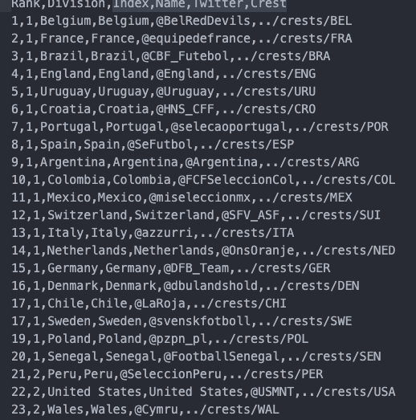
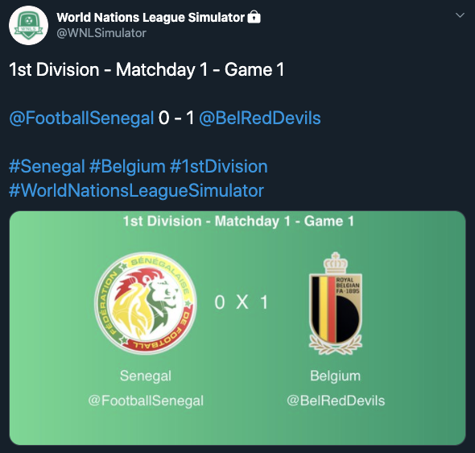

#LeagueBot

LeagueBot is a tool to create, simulate and tweet the results of a football league.

##Prerequisites

To use LeagueBot you need to install the following packages:

* Pandas
* Tweepy
* Imgkit

You will also need to put the clubs crests in the images/crests folder and make a csv file containing the teams information. The file shoud contain the following columns: Division, Index (that should be equal to the club name), Name, Twitter and Crest.

This is a part of the csv file I made:

## How to use

To start usaing LeagueBot you need to run the scripts in the home folder in the following order:

### json_maker.py

This script is in charge of transforming the csv file into a json file that will be used with the others scripts.

**Note**: This script shoud be used only in the first season.

##### Usage

    python3 json_maker.py your_csv_file.csv

### messages_creator.py

This script uses the json file to simulate one season of the league, it also creates a csv file containing the messages to be displayed.

##### Usage
    python3 messages_creator.py your_json_file.json

### images_creator.py

This script iterates through all the rows of the csv file created with messages_creator.py and creates jpg images with the html code inside each row.

##### Usage
    python3 images_creator.py your_json_file.json

### updater.py

This script also iterates through the csv file created with messages_creator.py. It will tweet the message inside the csv file along the image created with images_creator.py.

##### Usage
    python3 updater.py your_json_file.json

This is an example of a tweet sent by updater.py:

